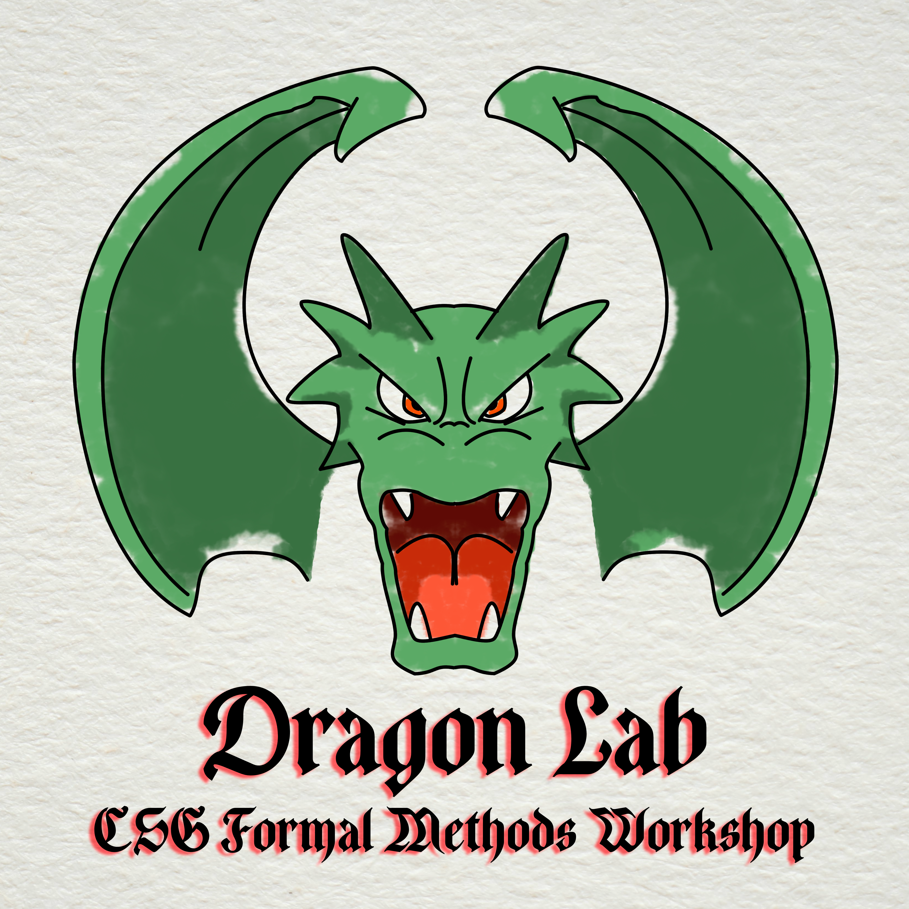

# DragonLab Student Repository



DragonLab is a semester-long workshop on Formal Methods.
Its curriculum is a selection of core concepts from the [Software Foundations](https://softwarefoundations.cis.upenn.edu/) series.

## Getting Started

1. Install [Rocq](https://rocq-prover.org/). If you install [opam](https://opam.ocaml.org/doc/Install.html), this can be done with
   ```bash
   make setup-env
   source activate_switch
   ```
   This repository assumes the user
   1. Has set up [Rocq via opam](https://rocq-prover.org/docs/using-opam)
   2. Is running in a Unix-like environment
   3. Is using either VSRocq or RocqIDE
   
   These are not strict requirements, and we will help you work around them if you have e.g. a Windows setup, or if you prefer to follow the [book's recommendation to run Rocq in a Docker environment](https://softwarefoundations.cis.upenn.edu/lf-current/Preface.html#lab8).
2. Clone this repo
    ```bash
    git clone https://github.com/utdcsg/DragonLab/ dragonlab
    cd dragonlab
    ```
3. Try compiling the book files
    ```bash
    make -j
    ```

    If this runs with no errors, you're ready to begin the course!

## Learning Objectives

Students should obtain working knowledge of the following upon completion of all units:

1. Basic syntax, data types, patterns, and proof strategies for the Rocq proof system
2. The Curry-Howard Isomorphism as it relates to program verification
3. Basic reasoning strategies for imperative programs, primarily
    - Large- and small-step operational semantics
    - Hoare logic and Separation logic
4. The simply-typed lambda calculus and its derivatives
5. The Verified Software Toolchain

See [the syllabus](./syllabus/syllabus.pdf) for more details
